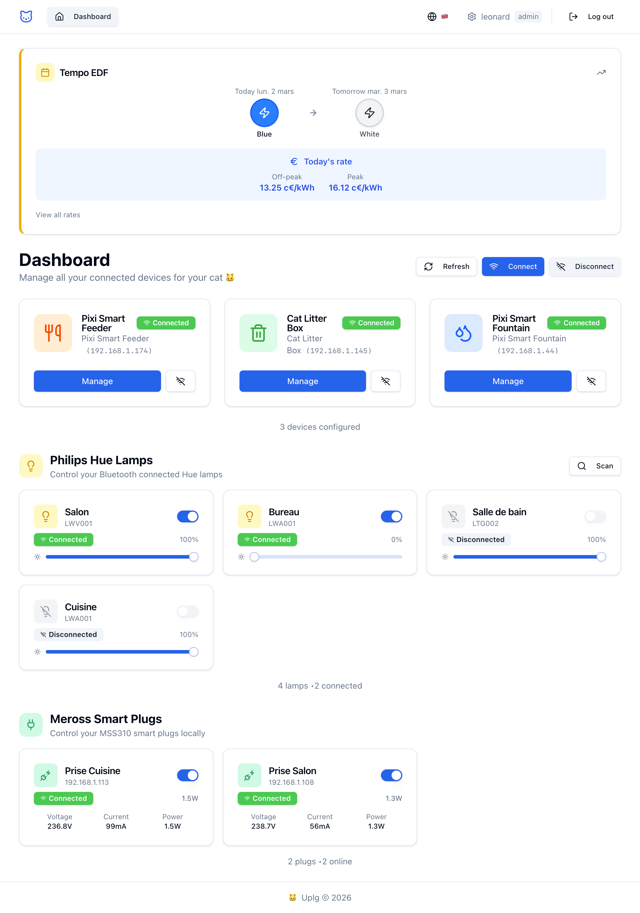

# Home Monitor

A full-stack application for monitoring and controlling Tuya-based smart cat devices locally. 

Built with **Elysia** (backend) and **React** (frontend), it provides comprehensive device management for smart feeders, fountains, automatic litter boxes, Hue lamps through BLE, Meross smart plugs, and EDF Tempo electricity pricing.

Concept: A custom "home assistant" without the overhead.




## Features

### Modern Web Interface

- **Dashboard**: Real-time overview of all connected devices
- **Device Control**: Intuitive controls for each device type
- **Meal Planning**: Visual meal schedule management for feeders
- **Multi-language**: Support for English and French (i18n)
- **Responsive Design**: Works on desktop and mobile

### Multi-Device Management

- **Device Status**: Real-time status monitoring for all connected devices
- **Connection Management**: Connect/disconnect all devices or individual devices
- **Device Types**: Support for feeders, fountains and litter boxes with type-specific endpoints

### Smart Feeder Control

- **Meal Plan Management**: Create, read, and update feeding schedules with Base64 encoding/decoding and caching
- **Manual Feeding**: Trigger immediate feeding sessions with customizable portions
- **Feeder status**: Retrieve detailed feeding logs with parsed timestamps and portion tracking
- **Multi-Feeder Support**: Manage multiple feeders independently

### Litter Box Monitoring

- **Comprehensive Status**: Monitor litter level, cleaning cycles, sensor data, and system state
- **Smart Controls**: Trigger cleaning cycles, configure sleep modes, and adjust settings
- **Sensor Analytics**: Track defecation frequency, duration, and maintenance alerts
- **Preference Management**: Control lighting, sounds, child lock, and kitten mode

### Smart Fountain Control

- **Real-time Monitoring**: Track water level, filter life, pump runtime, and UV operation
- **Light Control**: Turn the fountain light on/off remotely
- **Maintenance Resets**: Reset water time, filter life, and pump runtime counters
- **UV Management**: Control UV sterilization light and set runtime schedules
- **Eco Mode**: Switch between energy-saving modes for optimal efficiency
- **Alert System**: Monitor low water and no water warnings
- **Multi-Fountain Support**: Manage multiple fountains independently

### Philips Hue Bluetooth Lamps

- **Bluetooth Control**: Direct BLE connection to Philips Hue Bluetooth lamps (no bridge required)
- **Power & Brightness**: Turn lamps on/off and adjust brightness
- **Auto-discovery**: Automatic scanning and pairing of nearby lamps
- **Blacklist**: Hide neighbor's lamps from appearing in your dashboard

> **Note**: Hue Bluetooth requires running the backend locally (not in Docker). See [Hybrid Mode](#hybrid-mode-with-bluetooth) below.

### Meross Smart Plugs (MSS310)

- **100% Local Control**: Direct HTTP communication with MSS310 plugs on your LAN (no Meross cloud)
- **Power Toggle**: Turn plugs on/off from the dashboard or detail page
- **Real-time Electricity**: Live voltage (V), current (mA) and power (W) readings, polled every 5 seconds
- **Consumption History**: Daily energy consumption over the last 30 days (kWh)
- **DND Mode**: Toggle the LED indicator on the plug
- **Device Info**: Hardware version, firmware, MAC address, WiFi signal strength
- **Protocol**: HTTP POST to `http://<ip>/config` with MD5-signed JSON packets (`sign = md5(messageId + key + timestamp)`)

### EDF Tempo Pricing

- **Daily Color Display**: Shows today's and tomorrow's Tempo color (Blue/White/Red) from the [RTE public API](https://www.services-rte.com)
- **Tariff Rates**: Current off-peak and peak prices for each color, fetched from [data.gouv.fr](https://tabular-api.data.gouv.fr)
- **AI Predictions**: 7-day forecast powered by a Python prediction server (hybrid calibrated RTE algorithm using weather forecasts and regulatory constraints)
- **Prediction Calendar**: Visual calendar showing past actual colors and upcoming predicted colors with confidence scores
- **Regulatory Constraints**: Respects the 22 red-day and 43 white-day annual limits, weekend exclusions for red days, and seasonal rules (red only Nov-Mar)

### Advanced Diagnostics

- **DPS Scanning**: Discover available device data points with configurable ranges and timeouts
- **Real-time Monitoring**: Live device data updates and event tracking
- **Device Analytics**: Comprehensive device information and capability discovery

## Prerequisites

- [Bun](https://bun.sh) (latest version)
- [Docker](https://docker.com) & Docker Compose (for production deployment)
- One or more Tuya-compatible smart cat devices (feeders, fountains, litter boxes) and/or Hue lamps and/or Meross MSS310 smart plugs.
- Device credentials (ID, Key, IP) for each device

## Installation

### Development Setup

1. **Getting Device Credentials**

   To retrieve device credentials, you need a Tuya Cloud account (free):

   1. Create an account at https://iot.tuya.com
   2. Create a project and select the correct datacenter
   3. Add your devices (easiest way: scan QR code with Smart Life app)
   4. Use API Explorer > Device Management > Query device details
   5. Get the device ID from the devices list and retrieve the local key

   **Note**: The local key changes when the device is reset or removed from Smart Life.

2. **Clone the repository**

   ```bash
   git clone https://github.com/uplg/home-monitor.git
   cd home-monitor
   ```

3. **Install dependencies**

   ```bash
   # Install backend dependencies
   bun install

   # Install frontend dependencies
   cd frontend && bun install && cd ..
   ```

4. **Device Configuration**

   Create a `devices.json` file in the root directory with your device configurations:

   ```json
   [
     {
       "name": "Pixi Smart Feeder",
       "id": "your_feeder_device_id",
       "key": "your_feeder_device_key",
       "category": "cwwsq",
       "product_name": "Pixi Smart Feeder",
       "ip": "192.168.1.174",
       "version": "3.4"
     },
     {
       "name": "Cat Litter Box",
       "id": "your_litter_device_id",
       "key": "your_litter_device_key",
       "category": "msp",
       "product_name": "Cat Litter Box",
       "ip": "192.168.1.145",
       "version": "3.5"
     },
     {
      "name": "Pixi Smart Fountain",
      "id": "your_fountain_device_id",
      "key": "your_fountain_device_key",
      "category": "cwysj",
      "product_name": "Pixi Smart Fountain",
      "ip": "192.168.1.44",
      "version": "3.3"
     }
   ]
   ```

   **Device Configuration Fields:**

   - `name`: Friendly name for your device
   - `id`: Tuya device ID
   - `key`: Tuya device local key
   - `category`: Device category (cwwsq for feeders, msp for litter boxes)
   - `product_name`: Product name from Tuya
   - `ip`: Local IP address of the device
   - `version`: Tuya protocol version (usually 3.4 or 3.5)

4. **Meross Plug Configuration** (optional)

   Create a `meross-devices.json` file in the root directory:

   ```json
   [
     {
       "name": "Kitchen Plug",
       "ip": "192.168.1.113",
       "key": "your-shared-key",
       "uuid": "device-uuid",
       "mac": "48:E1:E9:XX:XX:XX"
     }
   ]
   ```

   - `key`: The shared signing key (set during initial provisioning, same for all plugs on the same account)
   - `uuid` / `mac`: Optional, for identification only. The plug is addressed by IP.

5. **Tempo Prediction** (optional)

   To enable AI-powered Tempo predictions, set up the Python prediction server with [pixi](https://pixi.sh):

   ```bash
   cd tempo-prediction
   pixi install              # Install Python environment and dependencies
   pixi run calibrate        # Calibrate the predictor (first time only)
   ```

   The prediction server runs on port 3034 by default. Start it with `pixi run serve` or use `make tempo-start` from the project root. The backend auto-connects to it.

6. **Environment Setup**

   ```bash
   cp .env.example .env
   ```

   Configure your `.env` file:

   ```env
   # API Server port
   PORT=3033

   # JWT Secret for authentication (generate a secure random string using `openssl rand -hex 16`)
   JWT_SECRET=your-super-secret-jwt-key-change-me
   ```

7. **Start the development server**

   ```bash
   # Start both backend and frontend in development mode
   bun run dev
   ```

   Or start them separately:

   ```bash
   # Backend only (port 3033)
   bun run dev:backend

   # Frontend only (port 5173)
   bun run dev:frontend
   ```

   - **Backend API**: `http://localhost:3033`
   - **Frontend**: `http://localhost:5173`
   - **OpenAPI Docs**: `http://localhost:3033/openapi`

---

## Deployment

### Docker Mode (without Bluetooth)

Run everything in Docker. Hue Bluetooth lamps are disabled in this mode.

```bash
docker-compose up -d --build   # Start
docker-compose down            # Stop
```

The app is available at `http://localhost` (port 80).

### Hybrid Mode (with Bluetooth)

To use Philips Hue Bluetooth lamps, run the backend locally (for Bluetooth access) and only the frontend in Docker.

```bash
make hybrid   # Starts local backend + Docker frontend
```

| Mode | Tuya Devices | Hue Lamps | HTTPS/PWA | Command |
|------|--------------|-----------|-----------|---------|
| Docker | ✅ | ❌ | ❌ | `docker-compose up -d` |
| Docker SSL | ✅ | ❌ | ✅ | `make ssl-up` |
| Hybrid | ✅ | ✅ | ❌ | `make hybrid` |
| Hybrid SSL | ✅ | ✅ | ✅ | `make hybrid-ssl` |
| Local dev | ✅ | ✅ | ❌ | `bun run dev` |

### Makefile Commands

```bash
make help              # Show all commands

# Development
make dev               # Start backend + frontend in dev mode
make backend-local     # Start backend only (background)
make backend-stop      # Stop local backend
make backend-logs      # Tail backend logs

# Docker
make docker-up         # Start Docker mode
make docker-down       # Stop Docker
make docker-build      # Build Docker images

# Hybrid (Bluetooth support)
make hybrid            # Local backend + Docker frontend

# PWA & SSL (mobile app access)
make ssl-setup         # Generate SSL certs + PWA icons
make ssl-up            # Start with HTTPS (Docker)
make ssl-down          # Stop SSL containers
make hybrid-ssl        # Hybrid mode with SSL

# Cleanup
make clean             # Stop everything
make status            # Show services status
```

### PWA / Mobile Access

To install Cat Monitor as an app on iPhone/Android:

1. **Generate SSL certificates** (uses [mkcert](https://github.com/FiloSottile/mkcert)):
   ```bash
   make ssl-setup
   ```

2. **Install the CA on iPhone**:
   - Run `mkcert -CAROOT` to find the CA file
   - AirDrop `rootCA.pem` to the iPhone
   - Install the profile, then go to **Settings → General → About → Certificate Trust Settings** and enable trust

3. **Start with SSL**:
   ```bash
   make ssl-up        # Full Docker
   make hybrid-ssl    # With Bluetooth
   ```

4. **Add to Home Screen**:
   - Open Safari → `https://<your-ip>`
   - Tap Share → "Add to Home Screen"

### Configuration

- Set `API_PORT` in `.env` to change the backend port (default: 3033)
- `devices.json` - Device configurations
- `meross-devices.json` - Meross smart plug configurations
- `devices-cache.json` - Cache for DPS that are not readable (only usable after a modification / event received)
- `users.json` - Users credentials (copy from `users.json.template`)
- `hue-lamps.json` - Hue lamps identifier if connected
- `hue-lamps-blacklist.json` - Blacklist to handle Hue lamps that don't belong to you (not connected once)

---

## API Documentation

### OpenAPI

Interactive API documentation is available at `http://localhost:3033/openapi`

## Troubleshooting

### Common Issues

1. **Device Connection Failed**

   - Verify device IP address and network connectivity
   - Check if device is powered on and connected to WiFi
   - Retry the request, Tuya devices don't support multi devices connected at the same time (it might be your phone as an example), else it's probably a wrong protocol version (3.3 instead of 3.4 as an example)

2. **ECONNRESET**

   - Double-check `id` and `key` in device.json
   - Verify device version (usually 3.3, 3.4 or 3.5 for recent tuya devices)

3. **Meal Plan Not Reading**

   - The device may not have a meal plan retrieved yet, DPS don't expose the raw data so we need to update (and then it's saved on instance)
   - Try setting a meal plan first using the POST endpoint

4. **DPS Scan Taking Too Long**
   - Use smaller ranges: `?start=1&end=50` instead of full scan
   - Reduce timeout: `?timeout=1000` for faster scanning
   - Target known DPS ranges for your device type

### Debug Mode

The API includes comprehensive logging. Check the console output for:

- Device connection status
- DPS scan results
- Meal plan encoding/decoding details
- Real-time event reports

## Architecture

### Tech Stack

```
| Layer    | Technology                              |
| -------- | --------------------------------------- |
| Backend  | Elysia, Bun, TuyAPI, @stoprocent/noble  |
| Frontend | React 19, Vite 7, TailwindCSS, TypeScript |
| UI       | Radix UI, Lucide Icons                  |
| State    | TanStack Query (React Query)            |
| i18n     | i18next                                 |
| Routing  | React Router v7                         |
| Linting  | oxlint                                  |
| Formatting | oxfmt                                 |
| ML       | Python, Hybrid RTE Algorithm (Tempo predictions) |
| Deploy   | Docker, nginx                           |
```

### Key Features

- **Framework**: Elysia (fast and ergonomic framework leveraging Bun)
- **Device Communication**: TuyAPI for Tuya device protocol
- **Meal Plan Encoding**: Custom Base64 binary format
- **Real-time**: Event-driven architecture with persistent connections
- **Authentication**: JWT-based auth with protected routes

## License

MIT License - see LICENSE file for details

## Contributing

1. Fork the repository
2. Create a feature branch
3. Make your changes
4. Add tests if applicable
5. Submit a pull request

## Support

For issues and questions:

- Check the troubleshooting section
- Leave an issue (try to add as much details as possible)

## Internationalization

The frontend supports multiple languages:

- 🇬🇧 English (default)
- 🇫🇷 Français

Language is auto-detected from browser settings, or can be changed manually in the UI.

To add a new language, create a new JSON file in `frontend/src/i18n/locales/` and register it in `frontend/src/i18n/index.ts`.

## Special Thanks

- [TuyAPI](https://github.com/codetheweb/tuyapi) for the device communication library
- [Tinytuya](https://github.com/jasonacox/tinytuya) for the wizard, helped a lot debugging version and discovering device capabilities

---

**Happy monitoring! 🐱🍽️💧🚽 🛋️**
